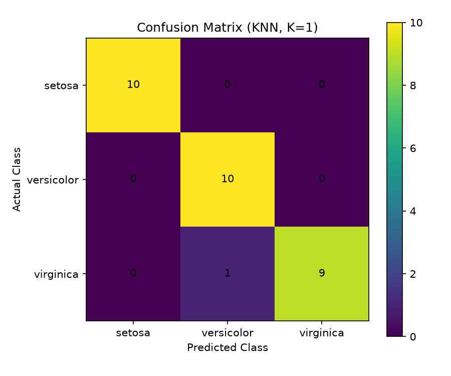
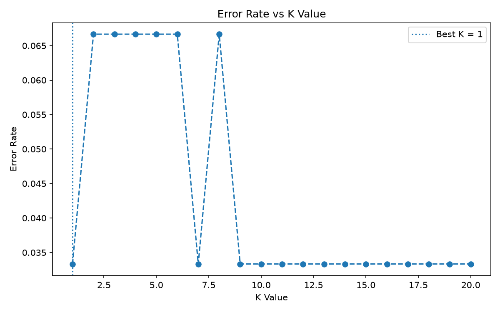

# Project 2: Data Classification Using AI

**DecodeLabs Industrial Training Kit — Batch 2026**

## 📌 Overview

This project builds a supervised machine learning model that classifies iris flowers into one of three species — **Setosa**, **Versicolor**, or **Virginica** — based on four physical measurements: sepal length, sepal width, petal length, and petal width.

The goal is to demonstrate the end-to-end pipeline of a basic classification task: loading data, splitting the dataset, preprocessing the features, training a model, making predictions, and evaluating its performance.

## 🎯 Objective

Build a basic classification model using a small dataset while applying core supervised learning concepts:

* Data handling
* Feature scaling
* Train/test splitting
* Model training
* Model evaluation
* Prediction on new data

## 🧠 Algorithm Used

**K-Nearest Neighbors (KNN)**

KNN classifies a new data point by looking at its **K closest neighbors** in the training data and assigning the majority class among those neighbors.

## 📊 Dataset

* **Source:** Iris dataset (`sklearn.datasets.load_iris`)
* **Samples:** 150
* **Classes:** 3 — Setosa, Versicolor, Virginica
* **Samples per class:** 50
* **Features:** 4
* **Measurements:** Sepal length, sepal width, petal length, petal width
* **Unit:** Centimeters (cm)

## ⚙️ Pipeline (IPO Framework)

| Stage       | Steps                                                                                                                         |
| ----------- | ----------------------------------------------------------------------------------------------------------------------------- |
| **Input**   | Load the Iris dataset                                                                                                         |
| **Process** | Split data into training/testing sets → Scale features using `StandardScaler` → Test different K values → Train the KNN model |
| **Output**  | Predictions → Accuracy → Confusion Matrix → F1 Score → Classification Report → New flower prediction                          |

### Pipeline

**Load → Split → Scale → Choose K → Train → Predict → Evaluate**

## 🛠️ Tech Stack

* Python 3
* NumPy
* pandas
* scikit-learn
* matplotlib

## 📂 Project Structure

```text
iris_project/
├── iris_classification.py   # Main source code
├── confusion_matrix.png     # Generated confusion matrix
├── elbow_plot.png            # Generated K-value tuning chart
└── README.md                 # Project documentation
```

## ▶️ How to Run

### 1. Open the project folder

Open the project folder in **VS Code**.

### 2. Install the required libraries

Open the VS Code terminal and run:

```bash
pip install numpy pandas matplotlib scikit-learn
```

### 3. Run the Python program

```bash
python iris_classification.py
```

The script will print dataset information, the selected K value, and model evaluation metrics to the console.

It will also generate two chart images in the project folder:

* `elbow_plot.png`
* `confusion_matrix.png`

## 📈 Results

The model is evaluated using the test dataset.

* **Best K value:** Determined automatically by testing K values from 1 to 20
* **Accuracy:** Approximately 96.7%
* **F1 Score (Macro):** Approximately 0.967
* **Test samples:** 30

The exact result may depend on the dataset split and the selected K value.

### Confusion Matrix



### K-Value Error Plot



## 🔑 Key Learnings

* How a dataset can be used to train a supervised machine learning model
* Why feature scaling is important for distance-based algorithms such as KNN
* How training and testing datasets are used to evaluate a model
* How KNN classifies new data using nearby data points
* How to test different K values instead of simply guessing one
* How a confusion matrix shows correct and incorrect classifications
* Why F1 Score can provide additional information beyond accuracy
* How a trained model can predict the class of a new flower

## 🌸 New Data Prediction

After training and evaluating the model, the project also demonstrates prediction on a **brand-new flower sample**.

The model receives four measurements:

```text
Sepal Length
Sepal Width
Petal Length
Petal Width
```

These measurements are scaled using the same scaler used during training, and the trained KNN model predicts the flower's species.

## 🎓 Project Concepts Demonstrated

This project demonstrates the basic supervised learning workflow:

1. **Load Data**
2. **Understand the Dataset**
3. **Split Training and Testing Data**
4. **Scale Features**
5. **Choose a Suitable K Value**
6. **Train the KNN Model**
7. **Make Predictions**
8. **Evaluate the Model**
9. **Predict New Data**

## 👤 Author

**Kashaf Zahra**

Submitted as part of the **DecodeLabs AI Industrial Training Program — Batch 2026**.

**Project 2: Data Classification Using AI**
